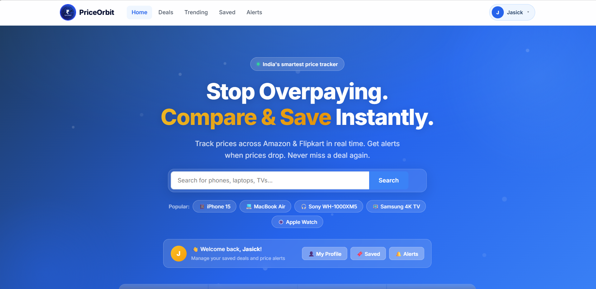
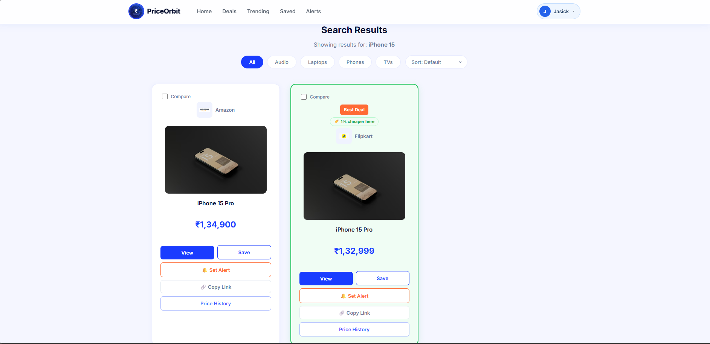
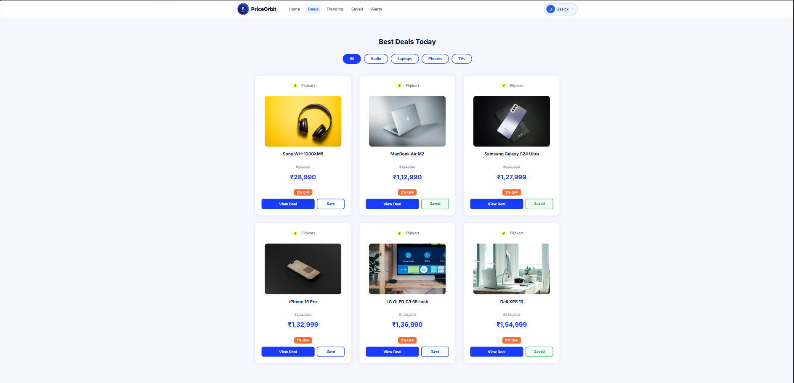
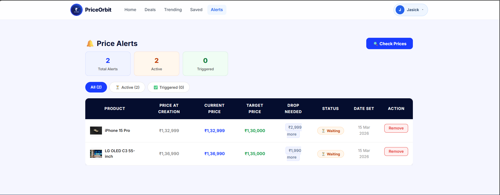
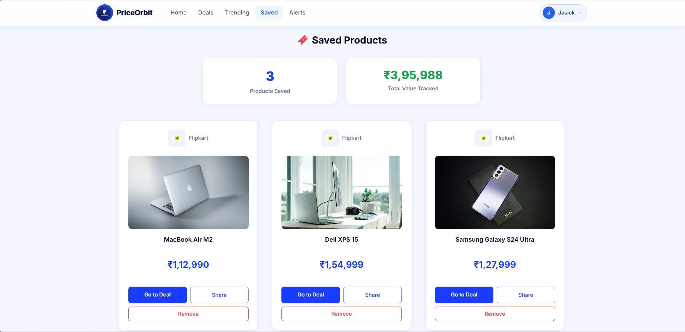

# PriceOrbit 🛒

> A full-stack price comparison web app for the Indian market — track prices across Amazon and Flipkart, set alerts, and never miss a deal.


**🌐 Live Demo: [https://price-orbit.vercel.app](https://price-orbit.vercel.app)**  
**🔧 Backend API: [https://priceorbit-backend.onrender.com](https://priceorbit-backend.onrender.com)**

---

## What is PriceOrbit?

PriceOrbit helps Indian shoppers compare product prices between **Amazon** and **Flipkart** in one place. Users can search products, compare prices side-by-side, view price history charts, save products, and set price drop alerts — all in a clean, modern interface built for the Indian market with ₹ pricing.

---

## Screenshots

### Home Page


### Search Results — Amazon vs Flipkart


### Deals Page


### Price Alerts


### Saved Products


---

## Features

### 🔍 Search & Compare
- Search products dynamically via DummyJSON API
- Side-by-side Amazon vs Flipkart price comparison
- Simulated price variance (±5–15%) with USD → INR conversion (1 USD = ₹83.5)
- Smart autocomplete with popular search suggestions
- Category filter buttons on Results and Deals pages

### 📈 Price History
- 6-month price history chart powered by Recharts
- Visual trend line showing price drops over time
- Price drop percentage badges on product cards

### 🔔 Price Alerts
- Set a target price for any product
- Backend checks prices and marks alerts as triggered
- Manage all alerts from a dedicated page with status tracking
- "View Deal" button on each alert row for quick access

### 🔐 Authentication
- Secure register and login with JWT tokens
- BCrypt password hashing
- Protected routes — saved items and alerts require login
- Persistent login with localStorage

### 🛍️ Discover
- **Deals page** — browse products by category with fresh fetches per filter
- **Trending page** — popular products across categories
- **Saved page** — bookmark products for later
- **Home DealsSection** — top 3 cheapest products shown on landing page

### 📦 Smart Caching
- MongoDB 24-hour cache for search results
- DataSeeder pre-warms cache on startup for instant category browsing
- Pre-warmed queries: laptop, smartphone, chair, juice, lipstick, watch, shirt, sneakers, handbag, sunglasses, motorcycle

---

## Tech Stack

### Frontend
| Technology | Purpose |
|------------|---------|
| React 18 (CRA) | UI framework |
| React Router v6 | Page navigation |
| Recharts | Price history charts |
| CSS3 | Styling with blue/white theme |

### Backend
| Technology | Purpose |
|------------|---------|
| Java 17 | Programming language |
| Spring Boot 3 | Backend framework |
| Spring Security | Authentication & CORS |
| JJWT | JSON Web Token generation |
| Lombok | Reducing boilerplate |
| Maven | Dependency management |

### Database & APIs
| Technology | Purpose |
|------------|---------|
| MongoDB Atlas (M0) | Cloud NoSQL database + caching |
| DummyJSON API | Mock product data source |

### Deployment
| Service | Purpose |
|---------|---------|
| Vercel | Frontend hosting |
| Render | Backend hosting |
| MongoDB Atlas | Cloud database |

---

## Project Structure
PriceOrbit/
├── screenshots/                      # App screenshots
│
├── frontend/                         # React 18 app (CRA)
│   ├── public/
│   │   ├── amazon.png                # Retailer logos
│   │   ├── flipkart.png
│   │   └── logo.png
│   └── src/
│       ├── components/               # Reusable components
│       │   ├── Navbar.jsx
│       │   ├── Footer.jsx
│       │   ├── SearchBar.jsx         # Autocomplete search
│       │   ├── Categories.jsx        # Category cards grid
│       │   ├── DealsSection.jsx      # Home page deals strip
│       │   ├── SkeletonCard.jsx
│       │   ├── OfflineBanner.jsx
│       │   ├── Spinner.jsx
│       │   ├── TrustedPlatforms.jsx
│       │   └── HowItWorks.jsx
│       ├── pages/                    # Route pages
│       │   ├── Home.jsx
│       │   ├── Results.jsx           # Search results + filters
│       │   ├── Deals.jsx             # Deals browser
│       │   ├── Trending.jsx
│       │   ├── Saved.jsx
│       │   ├── Alerts.jsx
│       │   ├── ProductDetail.jsx
│       │   ├── Profile.jsx
│       │   ├── SignIn.jsx
│       │   └── Register.jsx
│       └── config.js                 # Central API base URL
│
└── backend/                          # Spring Boot app
└── src/main/java/com/priceorbit/
├── controller/               # REST API endpoints
│   ├── ProductController.java
│   ├── UserController.java
│   └── AlertController.java
├── service/                  # Business logic
│   ├── ProductService.java   # 24hr MongoDB cache logic
│   ├── DummyJsonService.java # DummyJSON fetcher + price simulator
│   └── AlertService.java
├── model/                    # MongoDB document models
│   ├── Product.java
│   ├── User.java
│   └── Alert.java
├── repository/               # MongoDB repositories
│   ├── ProductRepository.java
│   ├── UserRepository.java
│   └── AlertRepository.java
├── config/                   # Security & CORS config
│   └── SecurityConfig.java
├── dto/                      # Data transfer objects
│   └── DummyJsonProduct.java
└── DataSeeder.java           # Pre-warms MongoDB cache on startup

---

## API Endpoints

### Auth
| Method | Endpoint | Description |
|--------|----------|-------------|
| POST | `/api/auth/register` | Register new user |
| POST | `/api/auth/login` | Login and get JWT token |

### Products
| Method | Endpoint | Description |
|--------|----------|-------------|
| GET | `/api/search?query={q}` | Search products (cached 24hr) |
| GET | `/api/products/{id}` | Get product by ID |
| GET | `/api/categories` | Get all cached category names |

### Users (Protected)
| Method | Endpoint | Description |
|--------|----------|-------------|
| GET | `/api/users/{id}` | Get user profile |
| GET | `/api/users/{id}/saved` | Get saved products |
| POST | `/api/users/{id}/saved` | Save a product |
| DELETE | `/api/users/{id}/saved/{productId}` | Remove saved product |

### Alerts (Protected)
| Method | Endpoint | Description |
|--------|----------|-------------|
| GET | `/api/alerts/user/{userId}` | Get user's alerts |
| POST | `/api/alerts` | Create price alert |
| POST | `/api/alerts/check` | Trigger price check |
| PATCH | `/api/alerts/{id}/read` | Mark alert as read |
| DELETE | `/api/alerts/{id}/user/{userId}` | Delete alert |

---

## Getting Started

### Prerequisites
- Java 17+
- Node.js 18+
- MongoDB Atlas account (free M0 tier works)
- Maven

### 1. Clone the repository
```bash
git clone https://github.com/Mohamedjasick/PriceOrbit.git
cd PriceOrbit
```

### 2. Configure the backend

Edit `backend/src/main/resources/application.properties`:
```properties
spring.data.mongodb.uri=your_mongodb_atlas_uri
spring.data.mongodb.database=priceorbit
jwt.secret=your_jwt_secret_key
```

### 3. Run the backend
```bash
cd backend
./mvnw spring-boot:run
# Runs on http://localhost:8080
# DataSeeder will pre-warm MongoDB cache automatically on startup
```

### 4. Configure the frontend

Edit `frontend/src/config.js`:
```js
const API_BASE_URL = process.env.REACT_APP_API_URL || 'http://localhost:8080';
export default API_BASE_URL;
```

For Vercel deployment, set environment variable:
REACT_APP_API_URL=https://priceorbit-backend.onrender.com

### 5. Run the frontend
```bash
cd frontend
npm install
npm start
# Runs on http://localhost:3000
```

---

## How It Works

### Price Simulation
Since DummyJSON provides USD prices, PriceOrbit:
1. Fetches product data from DummyJSON (`/products/search?q={query}`)
2. Converts USD → INR at 1 USD = ₹83.5
3. Simulates Amazon price at base price ±5–15%
4. Simulates Flipkart price at base price ±5–15%
5. Caches results in MongoDB for 24 hours

### Cache Strategy
- On startup, `DataSeeder` pre-warms MongoDB with popular queries
- On search, `ProductService` checks MongoDB first (24hr TTL)
- If cache miss, fetches from DummyJSON and saves to MongoDB
- Categories endpoint derives available categories from cached products

---

## Known Limitations

- Product data comes from **DummyJSON** (mock API) — not real Amazon/Flipkart prices
- Some categories like `fragrances`, `skin-care`, `home-decoration` have limited DummyJSON data and are excluded
- Price alerts are checked manually via "Check Prices" button — no automated background scheduler yet
- No email notifications for triggered alerts yet

---

## Roadmap

- [x] JWT Authentication
- [x] Product search with DummyJSON
- [x] Amazon vs Flipkart price simulation
- [x] MongoDB 24-hour caching
- [x] Price history charts
- [x] Price drop alerts
- [x] Saved products
- [x] Category browsing (Deals + Results pages)
- [x] Smart search autocomplete
- [x] Live deployment (Vercel + Render)
- [ ] Real Amazon/Flipkart API integration
- [ ] Email notifications for triggered alerts
- [ ] Background price check scheduler
- [ ] Mobile app (React Native)

---

## Author

**Mohamed Jasick**  
GitHub: [@Mohamedjasick](https://github.com/Mohamedjasick)

---

## License

This project is open source and available under the [MIT License](LICENSE).